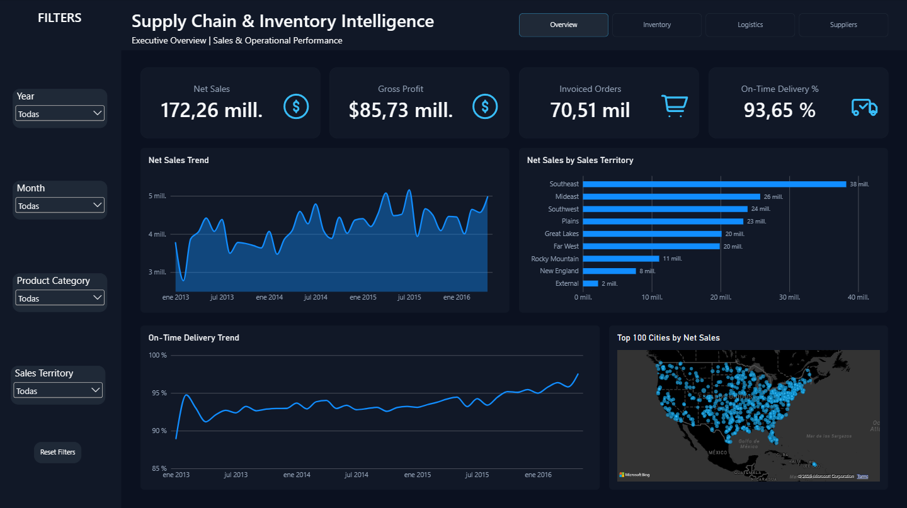
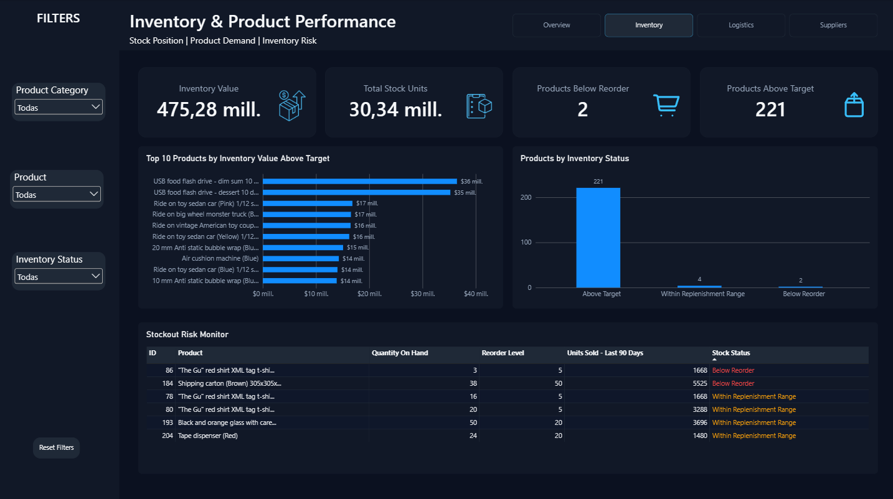
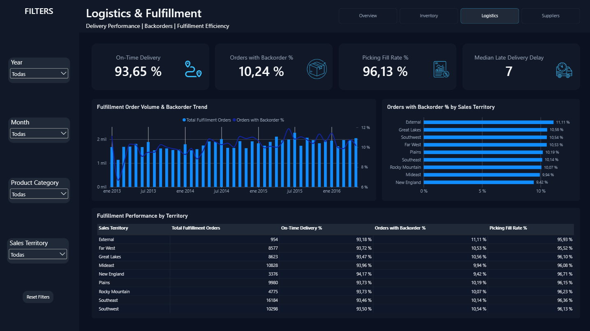
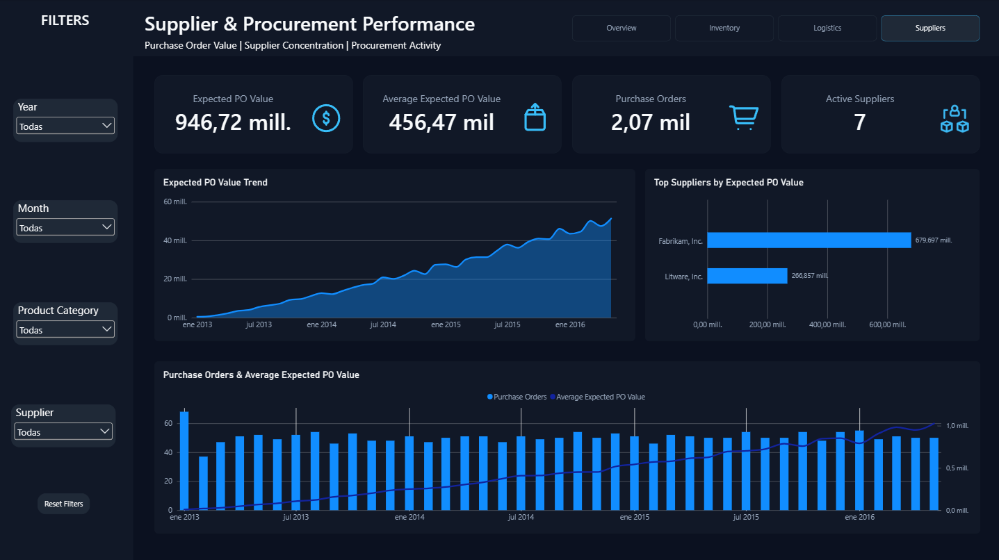
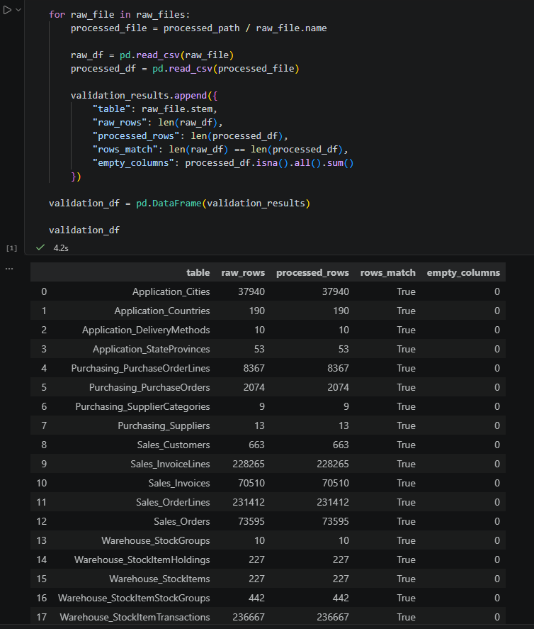
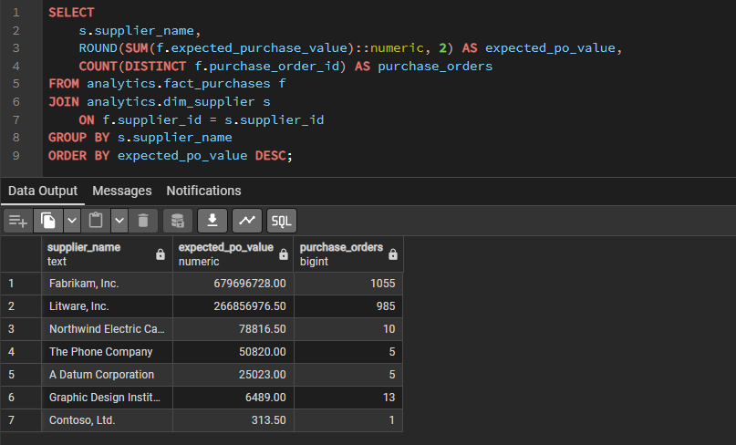
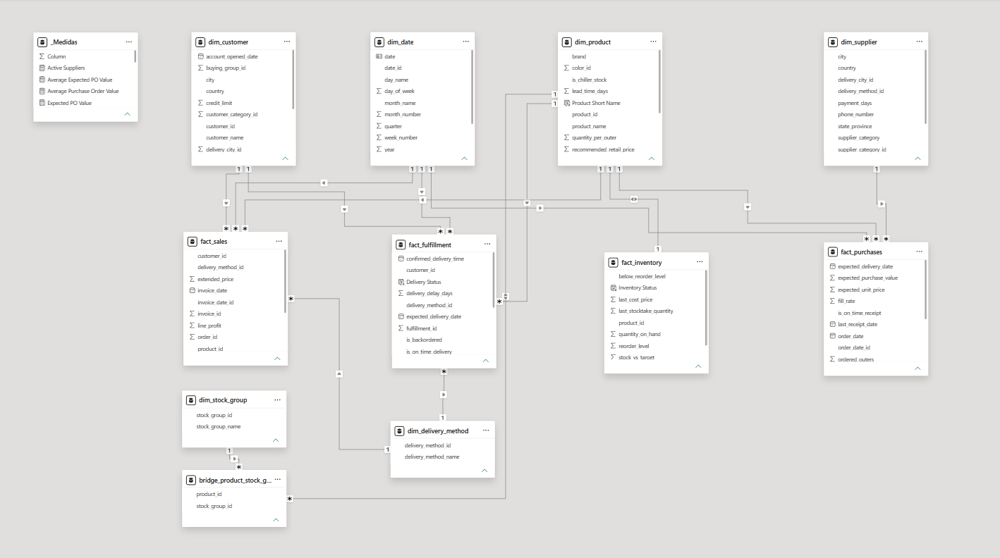

<h1 align="center">Supply Chain & Inventory Intelligence</h1>

<p align="center">
  <b>Santiago Vázquez</b><br>
  Proyecto de <b>Data Analytics & Business Intelligence</b> desarrollado sobre WideWorldImporters, orientado al análisis de ventas, inventario, logística y proveedores.
</p>

<p align="center">
  
  
  
  
  
</p>

---

## 📊 Dashboards

### Executive Overview

Vista general del desempeño comercial y operativo.



### Inventory & Product Performance

Análisis de stock, reposición y performance de productos.



### Logistics & Fulfillment

Análisis de entregas, backorders, picking y fulfillment.



### Supplier & Procurement Performance

Análisis de compras, órdenes y concentración de proveedores.




## 📌 Resultados Principales

* **Net Sales:** $172,26 M.
* **On-Time Delivery:** 93,65%.
* **Picking Fill Rate:** 96,13%.
* **Inventory Value:** $475,28 M.
* **Supplier Concentration:** Fabrikam y Litware concentran aproximadamente el **99,98% del Expected PO Value**.

---

## 🎯 Objetivo

El objetivo fue construir un dashboard integral que permitiera responder preguntas de negocio relacionadas con cuatro áreas:

* **Ventas:** evolución, rentabilidad y desempeño por territorio.
* **Inventario:** posición de stock y niveles de reposición.
* **Logística:** cumplimiento de órdenes, backorders y picking.
* **Proveedores:** órdenes de compra y concentración de proveedores.

Busqué que cada página respondiera una pregunta concreta y no simplemente mostrar gráficos aislados.

---

## 🔄 Flujo de Datos

`WideWorldImporters` ➔ `Python + pandas` ➔ `PostgreSQL` ➔ `SQL` ➔ `Power BI + DAX`

### Preparación con Python

Trabajé con **18 tablas** de WideWorldImporters.

Con Python y pandas realicé una revisión inicial de los datos:

* valores nulos y duplicados;
* tipos de datos;
* columnas vacías;
* conversión de fechas;
* validación de registros antes y después de la preparación.



### Análisis con SQL

SQL fue utilizado para explorar los datos y validar las métricas antes de incorporarlas al dashboard.

Entre los análisis realizados se encuentran:

* Net Sales y Gross Profit;
* ventas por territorio;
* niveles de inventario;
* backorders y fulfillment;
* retrasos de entrega;
* Expected PO Value por proveedor.



Las consultas principales están disponibles en la carpeta `sql/`.

### Modelo de Datos

En Power BI utilicé un modelo con dimensiones compartidas y cuatro tablas principales de hechos:

* `fact_sales`
* `fact_inventory`
* `fact_fulfillment`
* `fact_purchases`

Las principales dimensiones corresponden a fechas, productos, clientes, proveedores y métodos de entrega.



---

## 💡 Principales Insights

### Ventas

Las ventas netas muestran una evolución positiva durante el período analizado.

**Southeast** es el territorio con mayor nivel de Net Sales, seguido por Mideast y Southwest.

### Inventario

De los 227 productos:

* 221 están por encima del Target Stock Level;
* 4 se encuentran dentro del rango de reposición;
* 2 están por debajo del Reorder Level.

También incorporé las ventas de los últimos 90 días para dar mayor contexto al stock actual de los productos que requieren seguimiento.

### Logística

El **On-Time Delivery alcanza 93,65%** y mejora hacia el final del período.

El **10,24% de las órdenes** requirió generar un backorder y el Picking Fill Rate alcanza **96,13%**.

Para analizar retrasos utilicé la mediana por orden, obteniendo un retraso típico de **7 días** entre las entregas tardías.

### Proveedores

El Expected PO Value aumenta considerablemente mientras la cantidad mensual de Purchase Orders se mantiene relativamente estable.

Además, **Fabrikam y Litware concentran prácticamente todo el valor esperado de las órdenes de compra**, mostrando una fuerte dependencia de dos proveedores principales.

---

## 🧠 Algunas Decisiones de Análisis

Durante el proyecto fue necesario revisar varias interpretaciones iniciales de los datos:

* calculé **Net Sales excluyendo impuestos**;
* utilicé **Gross Profit** en lugar de interpretar `LineProfit` como resultado final;
* calculé On-Time Delivery y retrasos a nivel de **orden**, no de línea;
* corregí la lógica utilizada para identificar órdenes con backorder;
* evité interpretar automáticamente stock por encima del target como sobrestock;
* utilicé **Expected PO Value** porque el dataset no contiene el precio final facturado por los proveedores.

Estas revisiones fueron importantes para que los KPIs representaran correctamente la información disponible.

---

## 🛠️ Herramientas

* **Python + pandas:** preparación y validación de datos.
* **PostgreSQL:** almacenamiento y organización de las tablas.
* **SQL:** análisis y validación de métricas.
* **Power BI:** modelado y desarrollo del dashboard.
* **DAX:** creación de KPIs y medidas dinámicas.
* **Power Query:** ajustes dentro del modelo de Power BI.

---

## ⚠️ Limitaciones

* El período disponible finaliza en **mayo de 2016**, por lo que 2016 es un año parcial.
* `Products Above Target` no implica automáticamente sobrestock.
* `Expected PO Value` representa el valor esperado de las órdenes de compra y no el gasto final facturado.
* WideWorldImporters es una base de datos de ejemplo de Microsoft, por lo que algunos comportamientos responden a una simulación.

---

## ✅ Conclusión

El proyecto me permitió trabajar con distintas áreas de una operación dentro de una misma solución de Business Intelligence, combinando **Python, SQL, PostgreSQL y Power BI**.

Más allá de construir los dashboards, el foco estuvo en entender qué representaban los datos, validar los KPIs y transformar información transaccional en indicadores útiles para el análisis de negocio.

---

## 📂 Estructura del Repositorio

```text
Supply-Chain-Inventory-Intelligence/
├── data/
│   ├── raw/
│   └── processed/
├── notebooks/
├── sql/
├── powerbi/
├── screenshots/
└── README.md
```
